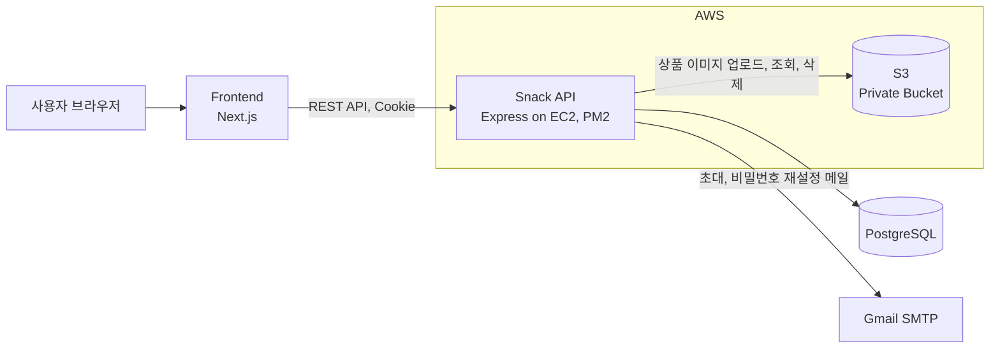
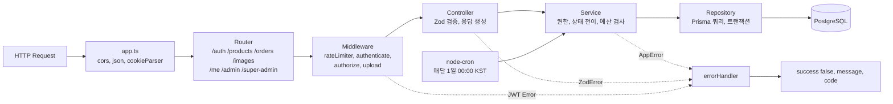
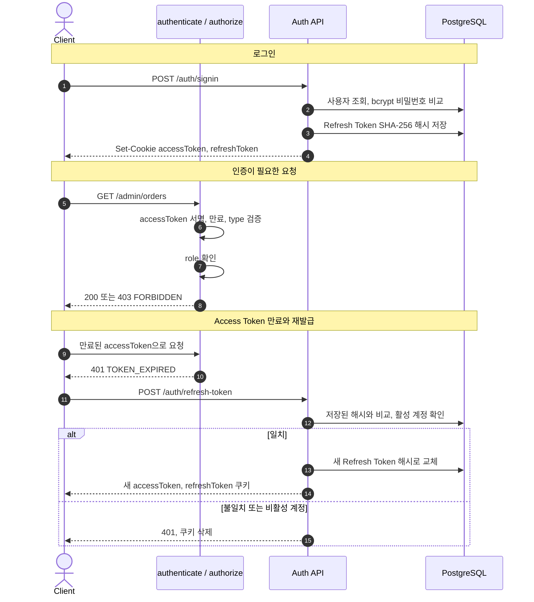
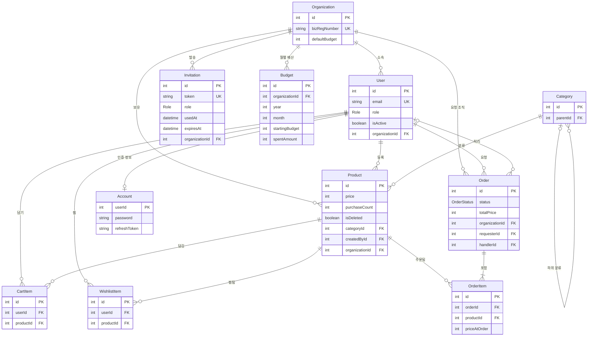
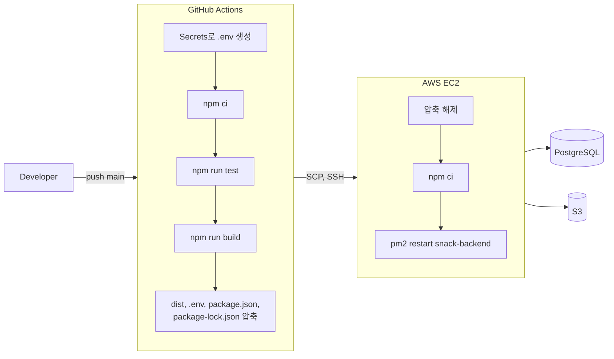

<div align="center">

# SNACK 🍪 Backend

### 사내 간식 구매부터 관리까지, 한 곳에서.

여러 플랫폼에 흩어진 간식 구매 내역을  
효율적으로 관리하기 위한 **원스톱 간식 구매 관리 서비스**의 API 서버

<br />

🚧 **현재 서비스 개발 및 README 문서화 진행 중입니다.**

<br />

`Express` · `TypeScript` · `Prisma` · `PostgreSQL` · `AWS`

</div>

---

## 💡 Key Features

- 🔐 인증 및 역할 기반 접근 제어 (JWT 쿠키 · Refresh Token Rotation · 비밀번호 재설정)
- 🛒 상품 · 장바구니 · 위시리스트 (S3 이미지 업로드 포함)
- 📝 구매 요청 및 승인 / 반려
- 👥 회원 및 초대 관리 (초대 메일 · 권한 변경 · 탈퇴 처리)
- 💰 예산 관리 (월 예산 자동 생성 · 승인 시 지출 반영 · 지출 요약)
- ⚙️ 관리자 / 최고 관리자 기능
- 📄 API 문서 (Swagger UI `/docs`)

## 🛠 Tech Stack

| 구분           | 사용 기술                                                       |
| -------------- | --------------------------------------------------------------- |
| Runtime        | Node.js 24, TypeScript                                          |
| Framework      | Express 5                                                       |
| Database / ORM | PostgreSQL, Prisma 7 (`@prisma/adapter-pg`)                     |
| Auth           | JWT (`jsonwebtoken`, `express-jwt`), HttpOnly Cookie, bcrypt    |
| Validation     | Zod                                                             |
| Infra          | AWS EC2, AWS S3 (`@aws-sdk/client-s3`, `multer-s3`), PM2        |
| 기타           | Nodemailer, node-cron, dayjs, express-rate-limit, Swagger, Jest |
| CI/CD          | GitHub Actions                                                  |

## 🏗 Architecture

### System Overview



### Request Lifecycle



**레이어 구성** — 도메인별로 `src/modules/<domain>/` 아래에 같은 구조를 둡니다.

| 파일              | 역할                                                              |
| ----------------- | ----------------------------------------------------------------- |
| `*.schema.ts`     | Zod로 body · query · params 검증, 입력 타입 추론                  |
| `*.controller.ts` | 요청 파싱, 서비스 호출, `{ success, data }` 응답과 쿠키 처리      |
| `*.service.ts`    | 비즈니스 규칙, `BadRequestError` · `NotFoundError` 등 커스텀 에러 |
| `*.repository.ts` | Prisma 쿼리와 트랜잭션                                            |

**역할 기반 라우터 구성** — 권한 검사를 라우터 진입 시점에 한 번에 적용합니다.

| Route 그룹       | 미들웨어                        | 대상                           |
| ---------------- | ------------------------------- | ------------------------------ |
| `/me/*`          | `authenticate`                  | 로그인한 본인 리소스           |
| `/admin/*`       | `authorize(ADMIN, SUPER_ADMIN)` | 구매 요청 승인·반려, 예산 요약 |
| `/super-admin/*` | `authorize(SUPER_ADMIN)`        | 회원 초대·관리, 예산 설정      |

상품·주문·회원·예산의 조회와 변경은 토큰의 `organizationId`로 범위를 제한해, 다른 조직의 데이터에는 접근할 수 없습니다.

### Project Structure

```text
src
├── server.ts        # 진입점: 이번 달 예산 확인 → cron 등록 → listen
├── app.ts           # 공통 미들웨어, 라우터, 404, 전역 에러 핸들러
├── config/          # Prisma Client, S3 Client, Swagger
├── routes/          # URL 구성 (me / admin / super-admin 그룹)
├── modules/         # auth, user, invitation, product, image,
│                    # cartItem, wishlist, order, budgets
├── middlewares/     # 인증·인가, 업로드, rate limit, errorHandler
├── schedulers/      # 월 예산 생성 cron
├── docs/            # Swagger(OpenAPI) 주석
├── types/           # 커스텀 에러 클래스, Express 타입 확장
└── utils/           # JWT, 비밀번호, 토큰 해시, 메일, KST 날짜
prisma/              # schema.prisma, migrations, seed
http/                # 수동 API 요청 파일 (.http)
```

팀 코딩 컨벤션은 [BE_CONVENTION.md](BE_CONVENTION.md)에 정리되어 있습니다.

## 🔐 Authentication & Authorization

Access Token과 Refresh Token을 모두 **HttpOnly 쿠키**로 발급합니다.



- 두 토큰은 서로 다른 secret으로 서명(HS256)하고, payload의 `type`(`access` / `refresh`)까지 검사합니다.
- DB에는 Refresh Token 원문이 아닌 해시만 저장하고, 재발급할 때마다 교체합니다.
- 로그아웃, 비밀번호 재설정, 회원 탈퇴 처리 시 저장된 Refresh Token을 지워 기존 세션을 끊습니다.
- 초대·비밀번호 재설정 토큰도 DB에는 해시만 저장합니다. (초대 7일, 재설정 30분 유효)
- 로그인, 회원가입, 재설정 메일 요청에 rate limit을 적용합니다.

| 역할          | 권한                                                               |
| ------------- | ------------------------------------------------------------------ |
| `GENERAL`     | 상품 등록·조회, 장바구니, 찜, 구매 요청, 본인 상품 수정·삭제       |
| `ADMIN`       | GENERAL 권한 + 구매 요청 승인·반려, 즉시 구매, 모든 상품 수정·삭제 |
| `SUPER_ADMIN` | ADMIN 권한 + 회원 초대·권한 변경·탈퇴 처리, 예산 설정, 회사명 변경 |

최고관리자는 기업 담당자 회원가입으로만 생성되고, 초대·권한 변경으로는 `GENERAL`, `ADMIN`만 부여할 수 있습니다.

## 📡 API Overview

전체 요청·응답 명세는 Swagger UI(`/docs`)에서 확인할 수 있습니다.

| 도메인     | 엔드포인트                                                             | 설명                                      |
| ---------- | ---------------------------------------------------------------------- | ----------------------------------------- |
| Auth       | `/auth/signup` `/auth/signin` `/auth/signout` `/auth/refresh-token`    | 최고관리자·초대 가입, 로그인, 토큰 재발급 |
|            | `/auth/password-reset`                                                 | 재설정 메일 요청, 새 비밀번호 설정        |
| Invitation | `/invitations/:token`                                                  | 초대 정보 조회                            |
| Me         | `/me` `/me/profile`                                                    | 내 정보 조회, 비밀번호·회사명 변경        |
| Product    | `/products` `/products/:id` `/me/products`                             | 상품 검색·정렬·등록·수정·소프트 삭제      |
| Image      | `/images` `/images/*key`                                               | S3 업로드, 서버 경유 조회, 삭제           |
| Cart       | `/me/cart-items`                                                       | 장바구니 담기·수량 변경·삭제              |
| Wishlist   | `/me/wishlist`                                                         | 찜 추가·삭제·목록                         |
| Order      | `/orders` `/me/orders`                                                 | 구매 요청, 내 요청 조회·취소              |
|            | `/admin/orders` `/admin/orders/:id/approve` `/admin/orders/:id/reject` | 조직 구매 요청 조회, 승인·반려            |
| Budget     | `/admin/budgets/summary` `/super-admin/budgets/setting`                | 지출 요약, 이번 달·기본 예산 설정         |
| Member     | `/super-admin/invitations` `/super-admin/users`                        | 회원 초대, 검색, 권한 변경, 탈퇴 처리     |

### 구매 요청과 예산 규칙

- 구매 요청은 본인 장바구니의 같은 조직 상품으로만 만들 수 있고, 생성 후 해당 장바구니 항목은 삭제됩니다.
- `GENERAL`의 요청은 `PENDING`으로 생성되고, `ADMIN` · `SUPER_ADMIN`의 요청은 예산 확인 후 바로 `APPROVED`로 생성됩니다.
- 상태 변경은 `PENDING`에서만 가능합니다: 요청자 취소(`CANCELED`), 관리자 반려(`REJECTED`), 관리자 승인(`APPROVED`).
- 승인 시 이번 달 남은 예산이 부족하면 `409 BUDGET_EXCEEDED`를 반환합니다.
- 승인은 하나의 트랜잭션에서 주문 상태 변경, 상품 `purchaseCount` 증가, 월 예산 `spentAmount` 증가를 함께 처리합니다.
- 월 예산은 매달 1일 00:00(KST) cron으로 생성하고, 서버 시작 시에도 이번 달 예산이 없는 조직에 생성합니다.

## 🗂 ERD

핵심 키와 관계 위주로 표시했습니다.



- `Role`: `GENERAL` · `ADMIN` · `SUPER_ADMIN` / `OrderStatus`: `PENDING` · `APPROVED` · `REJECTED` · `CANCELED`
- `Account.userId`는 `User.id`를 참조하는 PK이자 FK입니다.
- 상품·회원은 `isDeleted` · `isActive`로 소프트 삭제하고, `OrderItem.priceAtOrder`에 주문 시점 가격을 저장해 과거 주문 내역을 보존합니다.
- 복합 UNIQUE: `CartItem`·`WishlistItem`의 `(userId, productId)`, `Budget`의 `(organizationId, year, month)`

## 🚀 CI/CD & Deployment

`main` 브랜치에 push하면 [`.github/workflows/deploy.yml`](.github/workflows/deploy.yml)이 실행됩니다.



| 단계                                      | 현재 상태                                         |
| ----------------------------------------- | ------------------------------------------------- |
| 테스트 · 빌드 · EC2 전송 · PM2 재시작     | 자동 (GitHub Actions)                             |
| 환경변수                                  | GitHub Secrets(`ENV`)로 `.env`를 만들어 함께 전송 |
| PM2 프로세스 최초 등록                    | 수동 (워크플로는 `pm2 restart`만 실행)            |
| DB 마이그레이션 (`prisma migrate deploy`) | 수동 (워크플로에 포함되어 있지 않음)              |

테스트는 현재 `src/utils/password.test.ts` 1개로, CI의 Jest 단계 실행을 확인하는 용도입니다.

## ⚙️ Getting Started

```bash
cp .env.example .env   # 값 입력 후 진행
npm install            # postinstall에서 prisma generate 실행
npm run migrate        # prisma migrate dev
npm run seed           # 주의: 모든 테이블을 비우고 데모 데이터를 다시 넣음
npm run dev            # tsx watch, http://localhost:3000/docs
```

| 명령                        | 설명                                                        |
| --------------------------- | ----------------------------------------------------------- |
| `npm run dev`               | 개발 서버 (`tsx watch src/server.ts`)                       |
| `npm run build`             | TypeScript 빌드 (`dist/`)                                   |
| `npm start`                 | 빌드 결과 실행 (`node --enable-source-maps dist/server.js`) |
| `npm run type-check`        | 타입 검사                                                   |
| `npm test`                  | Jest 테스트                                                 |
| `npm run migrate`           | 개발 DB 마이그레이션 (`prisma migrate dev`)                 |
| `npm run seed`              | 개발용 시드 데이터                                          |
| `npm run studio`            | Prisma Studio                                               |
| `npx prisma migrate deploy` | 운영 DB 마이그레이션 (script 미등록)                        |

### Environment Variables

실제 값은 저장소에 포함하지 않습니다. 형식은 [`.env.example`](.env.example)을 참고하세요.

| 변수                                                                             | 용도                                    |
| -------------------------------------------------------------------------------- | --------------------------------------- |
| `DATABASE_URL`                                                                   | PostgreSQL 연결                         |
| `PORT`, `NODE_ENV`                                                               | 서버 포트, 운영 모드(쿠키·Swagger 경로) |
| `JWT_ACCESS_SECRET`, `JWT_REFRESH_SECRET`                                        | 토큰 서명                               |
| `JWT_ACCESS_EXPIRES_IN`, `JWT_REFRESH_EXPIRES_IN`                                | 토큰 만료 (기본 15m / 3d)               |
| `CLIENT_URL`                                                                     | CORS origin, 메일 링크 주소             |
| `AWS_REGION`, `AWS_S3_BUCKET_NAME`, `AWS_ACCESS_KEY_ID`, `AWS_SECRET_ACCESS_KEY` | S3 (키가 없으면 AWS SDK 기본 자격 증명) |
| `API_BASE`                                                                       | 응답 이미지 URL 접두사                  |
| `SWAGGER_SERVER_URL`                                                             | Swagger 서버 주소                       |
| `GMAIL_USER`, `GMAIL_APP_PASSWORD`                                               | 메일 발송                               |
